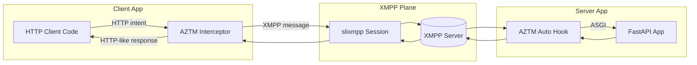
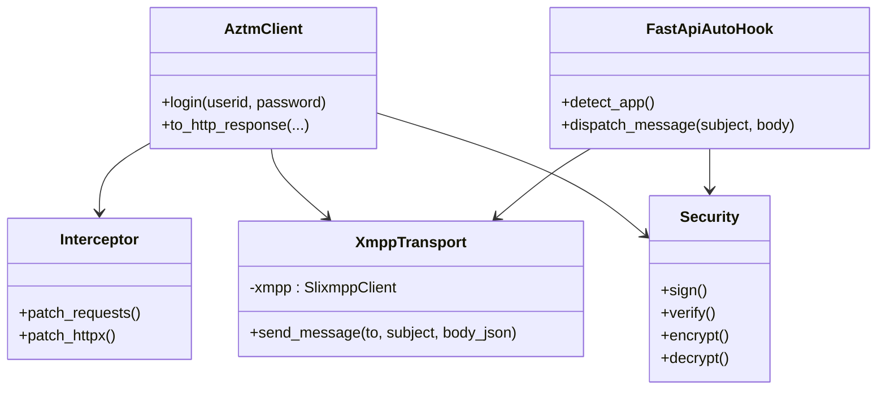
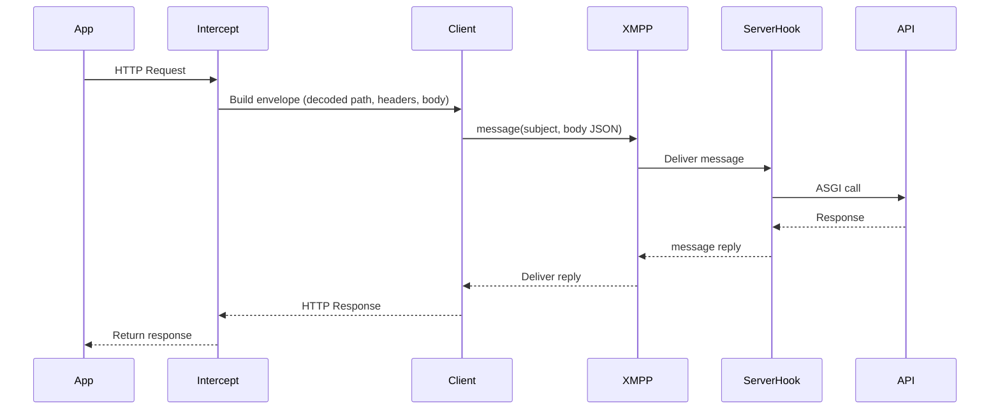
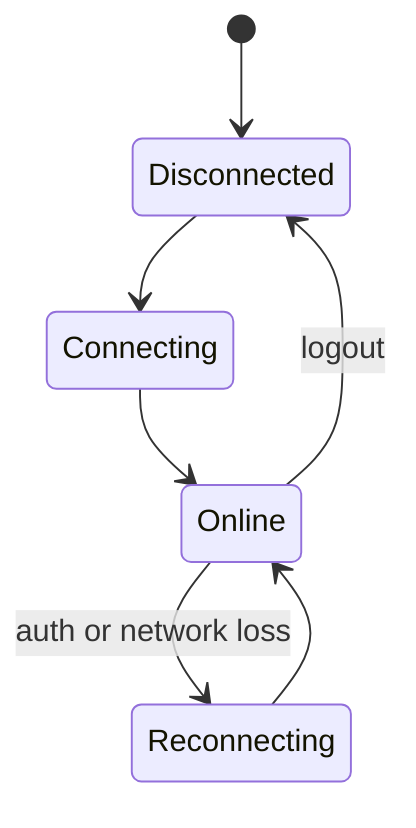
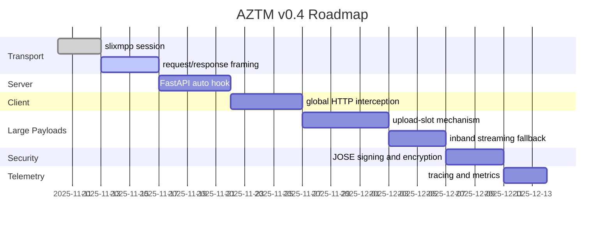

# AZTM (Agentic Zero Trust Mesh) Python SDK — Product Design Document

**Version:** v0.4
**Owner:** Elad Rave
**SDK name:** `aztm`
**Runtime:** Python 3.9+
**Transport runtime:** XMPP via `slixmpp` (fully hidden from application code)
**Primary goal:** Replace HTTP transport with identity based messaging using XMPP, while keeping existing client and server code unchanged other than `import aztm` and a single `aztm.login(...)` call.

---

## 1. Executive summary

AZTM allows existing Python HTTP clients and FastAPI servers to communicate over XMPP users instead of IP addresses. Both sides log in to a Jabber server. Client HTTP requests are intercepted and serialized into XMPP messages addressed to the service username. The server auto hooks FastAPI and dispatches messages to routes. Small payloads travel inline. Medium payloads are streamed. Large payloads use upload slots that require only outbound HTTPS, so the API server can remain behind NAT and firewalls with no open ports.

Only required code changes anywhere in the codebase:

```python
import aztm
aztm.login(userid="...", password="...")
```

---

## 2. Goals and non-goals

### Goals

1. Zero code change beyond `import aztm` and `aztm.login(...)`.
2. Automatic client side interception for `requests` and `httpx`.
3. Automatic server side FastAPI hook and dispatch.
4. Preserve HTTP semantics: method, path, headers, body, status, errors.
5. Security: TLS to XMPP, optional JOSE signing and encryption, optional OMEMO.
6. Large payloads without inbound ports using upload slots.
7. Observability and correlation across the full path.

### Non-goals for v1

* Multi language SDKs.
* Multi domain federation policies.
* Optimized binary codecs beyond JSON or base64.

---

## 3. Architecture overview



Key ideas:

* URL host maps to the XMPP username. Domain comes from the caller user id.
* HTTP request is packed as JSON in the message body. The subject carries the decoded path.

---

## 4. Addressing and subject mapping

### Host to user mapping

`https://orders.api/...` is addressed to `orders.api@<domain>`.
`<domain>` is derived from the caller `userid`, for example `client@xmpp.example` gives `xmpp.example`.

### Subject equals decoded path

Rules:

1. Take the HTTP path from the request.
2. URI decode it.
3. Remove the leading slash.
4. Do not include query string or fragment.
5. Preserve case and punctuation exactly.
6. If the path is `/`, set subject to `root` by default.

Examples:

| HTTP request                            | Subject             | `_aztm.path`         |
| --------------------------------------- | ------------------- | -------------------- |
| `POST https://my.com/function1/action1` | `function1/action1` | `/function1/action1` |
| `PUT https://svc.com/users/%7Bid%7D`    | `users/{id}`        | `/users/{id}`        |
| `GET https://api.com/`                  | `root`              | `/`                  |

Optional mapper hook: `AZTM_FUNCTION_MAPPER=module:callable` can override, but default behavior should be sufficient for FastAPI parity.

---

## 5. Wire format

**Stanza type:** `message` for request and response.
**Body:** JSON envelope with `_aztm` control block and application `payload`.
**Correlation:** XMPP `message id` plus `_aztm.corr` UUID echoed in replies.

### Request

```xml
<message to='orders.api@domain' type='chat' id='uuid' subject='orders/create'>
  <body>{
    "_aztm": {
      "ns": "urn:aztm:v1",
      "method": "POST",
      "path": "/orders/create",
      "query": "foo=1&bar=2",
      "headers": {"Content-Type": "application/json", "Authorization": "Bearer ..."},
      "corr": "3f7de4f1-5a4e-4a4a-9b93-1ebf7e1e1b2b",
      "ts": 1731250000
    },
    "payload": {"sku": "ABC", "qty": 1}
  }</body>
</message>
```

### Response

```xml
<message to='client@domain' type='chat' id='uuid2' subject='orders/create:result'>
  <body>{
    "_aztm": {"status": 201, "headers": {"Content-Type": "application/json"}, "corr": "3f7de4f1-5a4e-4a4a-9b93-1ebf7e1e1b2b"},
    "payload": {"orderId": 123}
  }</body>
</message>
```

Streaming extension is described in section 10.

---

## 6. Security model

* Transport security: TLS between both sides and the XMPP server.
* Authentication: SASL using `userid` and `password`. Domain derived from `userid`.
* Optional end to end: JOSE signing and encryption of the JSON body, or OMEMO where available.
* Replay protection: `_aztm.ts` monotonic timestamp plus correlation id window.
* Authorization:

  * Application bearer token in `_aztm.headers.Authorization`.
  * Adapter injects `X-AZTM-From-JID` so the app can verify token to JID binding and enforce per route ACLs.

---

## 7. SDK usage and behavior

### 7.1 Initialization

```python
import aztm
aztm.login(userid="client@xmpp.example", password="...")   # client
# or
aztm.login(userid="orders.api@xmpp.example", password="...")  # server
```

Effects of `login`:

* Establishes a `slixmpp` session with auto reconnect.
* Patches `requests` and `httpx` to intercept calls.
* Detects FastAPI app in process and auto registers the inbound message handler.

### 7.2 Client example

```python
import aztm, requests

aztm.login(userid="client@xmpp.example", password="...")

# Routed to orders.api@xmpp.example with subject "orders/create"
resp = requests.post("https://orders.api/orders/create", json={"sku": "ABC", "qty": 1})
print(resp.status_code, resp.json())
```

### 7.3 Server example

```python
from fastapi import FastAPI
import aztm

app = FastAPI()
aztm.login(userid="orders.api@xmpp.example", password="...")
# No attach call needed. AZTM auto hooks FastAPI for inbound messages.
```

---

## 8. Components



---

## 9. Request lifecycle



---

## 10. Handling large payloads

Three size classes are supported:

### 10.1 Small, inline

* Threshold: `AZTM_INLINE_LIMIT_KB` (default 128 KB).
* Entire request body is in the XMPP message body JSON.
* Optional gzip.

### 10.2 Medium, streamed

* Between `AZTM_INLINE_LIMIT_KB` and `AZTM_STREAM_LIMIT_MB` (default 5 MB).
* Chunked messages with ordered reassembly.
* Envelope includes:

  * `stream.id`, `seq`, `eof`
  * `sha256` integrity
* Resume protocol:

  * Server signals `resume from seq n` on gap detection.
* Backpressure:

  * Window size from `AZTM_STREAM_WINDOW` (default 8).

### 10.3 Large, upload slots

* Above `AZTM_STREAM_LIMIT_MB`.
* Uses upload slots similar to XEP-0363, but presented as a generic slot service.
* No inbound ports on the API server.
* Flow:

  1. Client requests a slot via control message.
  2. Slot broker returns PUT URL and metadata, short lived and single use.
  3. Client uploads via outbound HTTPS PUT.
  4. Client sends control message with key, size, checksum, content type, corr.
  5. API server downloads via outbound HTTPS GET using server credentials.
* Default read isolation policy: **server-only GET via IAM**. Clients do not receive a GET URL.

Integrity:

* Require `sha256` for medium and large.
* Validate hash before handler invocation.

Security:

* Encrypt large payloads client side if needed, upload ciphertext, send CEK wrapped in the control message for the server to decrypt.

---

## 11. Reliability and ordering

* Correlation via `message id` plus `_aztm.corr`.
* Timeouts with exponential backoff and jitter.
* Idempotency keys for unsafe methods via `_aztm.headers["Idempotency-Key"]`.
* Stream resume and flow control for medium class.
* Offline queue with TTL on the client.



---

## 12. Observability

Metrics:

* `aztm.request_bytes`, `aztm.response_bytes`
* `aztm.stream_chunks_total`, `aztm.stream_retries_total`
* `aztm.upload_slot_latency_ms`, `aztm.download_latency_ms`
* `aztm.reconnects_total`, `aztm.requests_total`, `aztm.errors_total`

Logs:

* JIDs, subject, corr id, latency, HTTP status, transfer mode, chunk ranges.

Trace propagation:

* Carry W3C `traceparent` and `tracestate` in `_aztm.headers` and mirror in response.

---

## 13. Configuration keys that hide protocol details

```text
# Size thresholds
AZTM_INLINE_LIMIT_KB=128              # max inline JSON size
AZTM_STREAM_LIMIT_MB=5                # above this, use streaming or slot

# Large transfer strategy
AZTM_LARGE_TRANSFER_MODE=auto         # auto | slot | inband | p2p
AZTM_LARGE_TRANSFER_FALLBACK=inband   # fallback if primary is unavailable

# Feature toggles
AZTM_FEATURE_UPLOAD_SLOTS=1           # enables slot based transfer
AZTM_FEATURE_INBAND_STREAM=1          # enables in-band streaming fallback
AZTM_FEATURE_PEER_STREAM=0            # reserved for future peer streams

# Integrity and flow control
AZTM_STREAM_WINDOW=8                  # in-flight chunks for streams
AZTM_CHECKSUM_ALG=sha256              # integrity algorithm

# Subject handling
AZTM_EMPTY_SUBJECT=root               # subject to use when path is "/"

# Optional function mapper (rarely needed)
AZTM_FUNCTION_MAPPER=module:callable
```

None of these names expose XMPP.

---

## 14. Error handling

* Transport errors map to HTTP 503 Service Unavailable by default.
* XMPP message format or contract errors map to 400 Bad Request.
* Application exceptions map to 500 Internal Server Error, sanitized unless `AZTM_DEBUG=1`.
* Large transfer failures include explicit reason and retriable flag.

---

## 15. Testing strategy

* Unit tests for intercept, subject mapping, serialization, and error mapping.
* Integration tests with Openfire in Docker.
* Contract parity tests: direct HTTP vs AZTM-transported requests.
* Chaos tests: disconnects, reordering, partial chunk loss, slot expiry.

---

## 16. NAT and firewall guarantees

* API server requires only outbound connections.

  * Outbound XMPP client to server.
  * Outbound HTTPS to upload slot endpoints.
* No inbound ports on the API server.
* Upload slots are provided by Openfire or its storage backend.

---

## 17. DevOps requirements and deployment guide

Assume XMPP server is **Openfire** running in AWS.

### 17.1 Capabilities required

* Core XMPP with TLS and SASL.
* Message stanza delivery.
* Upload slot service for large payloads.
* Optional stream management for reliability.

### 17.2 Openfire version and ports

* Openfire 4.7.0 or newer.
* Ports that must be reachable to Openfire:

  * 5222: XMPP client to server, inbound to Openfire.
  * 7443: HTTPS upload slot service, inbound to Openfire.
  * 9090 or 9091: Admin console, internal only.
  * 5269: Server to server, optional for federation.

AZTM application servers never open ports.

### 17.3 Users and service accounts

Create users:

* `orders.api@xmpp.example`
* `inventory.api@xmpp.example`
* Clients like `user1@xmpp.example`

Set long random passwords.

### 17.4 TLS and certificates

* Valid certificate for `xmpp.example` on C2S and upload endpoint.
* Let’s Encrypt or internal CA.

### 17.5 Enabling upload slots

* In Openfire Admin Console:

  * Install the HTTP File Upload plugin.
  * Enable HTTPS for slots.
  * Configure max upload size above `AZTM_STREAM_LIMIT_MB`.
  * Configure retention and auto delete.

Endpoint may look like:
`https://xmpp.example:7443/httpfileupload/`

### 17.6 Scaling and storage

* Front upload slot with NGINX, HAProxy, or ALB if needed.
* Store objects in S3 or MinIO.
* Configure short retention times for slot objects.

### 17.7 Security for uploads

* Only authenticated users can request slots.
* Slots are single use and short lived.
* Include requester JID hash in object key prefix:
  `uploads/{jid_hash}/{corr_uuid}/{random}.bin`
* Enforce checksum and content length.

### 17.8 Read isolation default: server-only

* The client receives a PUT URL and the object key, not a GET URL.
* The API server downloads using its own IAM role or key, permitted to `s3:GetObject` on the upload prefix.
* Bucket policy denies public reads and denies reads to client identities.

### 17.9 Monitoring

* XMPP session counts and SASL failures.
* Stream resumption events.
* Upload slot service throughput and errors.
* Storage space and object retention.
* TLS expiry.

---

## 18. Security playbook checklist

1. Require TLS everywhere.
2. Enforce SASL authentication for all users.
3. AZTM server adapter injects `X-AZTM-From-JID` into request context.
4. Validate bearer token against the mapped JID identity.
5. Maintain per route ACLs keyed by subject, method, and caller JID.
6. Sign and optionally encrypt JSON bodies with JOSE for tamper resistance.
7. For large uploads:

   * Use server-only GET via IAM.
   * Enforce checksum and content length.
   * Set short slot expiry and auto delete.
8. Rotate keys regularly.
9. Log corr ids, subjects, and outcomes for all requests.
10. Alert on repeated failures, high retry counts, or integrity mismatches.

---

## 19. POC roadmap



---

## 20. Appendix: reference code

### Client

```python
import aztm, requests

aztm.login(userid="client@xmpp.example", password="...")

# Sent to orders.api@xmpp.example, subject "orders/create"
r = requests.post("https://orders.api/orders/create", json={"sku": "ABC", "qty": 1})
print(r.status_code, r.json())
```

### Server

```python
from fastapi import FastAPI
import aztm

app = FastAPI()
aztm.login(userid="orders.api@xmpp.example", password="...")
# AZTM auto hooks FastAPI, no attach call needed
```

### Custom subject mapper (optional)

```python
# mappers.py
def subject_from_request(method: str, path: str) -> str:
    # default behavior is decoded path without leading slash
    # override only if you must reshape subject naming
    return path.lstrip("/")
```

---

## 21. Open items

1. Confirm that `root` is the desired subject for `/`.
2. Choose upload slot endpoint exposure model in production: public behind reverse proxy or private to corporate network.
3. Decide if JOSE signing is required by default for all requests, or only for sensitive routes.

